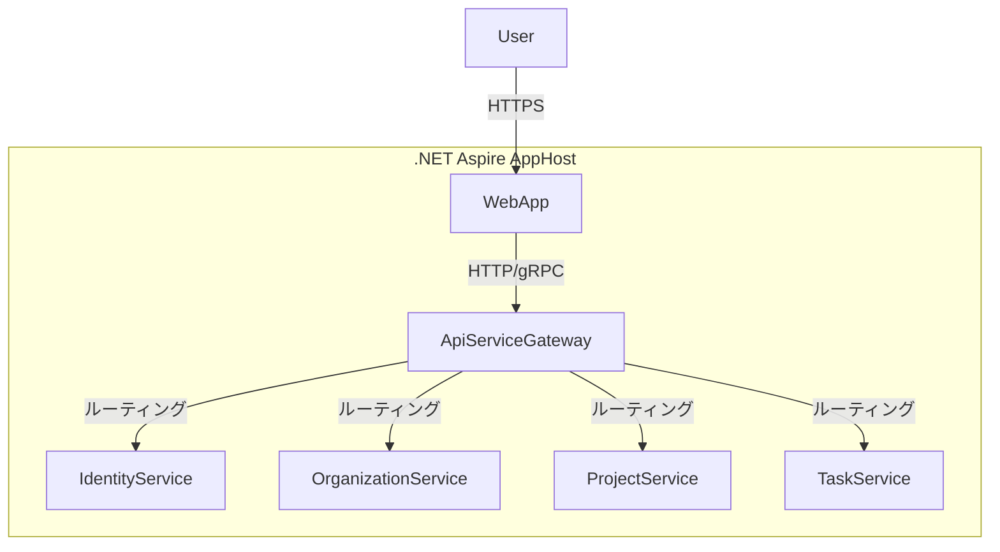

# プロジェクト管理システム 設計書

## 1. 概要

本システムは、組織、プロジェクト、タスクの階層構造で管理を行うプロジェクト管理ツールです。.NET Aspireを採用し、スケーラブルで保守性の高いマイクロサービスアーキテクチャで構築します。

## 2. システムアーキテクチャ

.NET Aspire を活用し、各機能を独立したマイクロサービスとして開発します。

- **AppHost:** .NET Aspireのオーケストレーションプロジェクト。
- **ApiServiceGateway:** 各マイクロサービスへの単一窓口となるAPIゲートウェイ。
- **IdentityService:** ユーザー認証とグローバルなユーザー情報を管理するサービス。
- **OrganizationService:** 組織、組織へのユーザー招待、組織レベルの役割を管理するサービス。
- **ProjectService:** プロジェクト、プロジェクトメンバー、プロジェクトレベルの役割を管理するサービス。
- **TaskService:** タスク、担当者、コメントなどを管理するサービス。
- **WebApp:** ユーザーが操作するためのフロントエンドアプリケーション (Blazor Web App)。



## 3. データモデル

### 主要エンティティの詳細

#### User (ユーザー)
```
- Id: Guid (PK)
- Email: string (Unique, Required)
- PasswordHash: string (Required)
- Name: string (Required)
- IsSystemAdmin: bool (Default: false)
- IsActive: bool (Default: true)
- CreatedAt: DateTime
- UpdatedAt: DateTime
- LastLoginAt: DateTime?
```

#### Organization (組織)
```
- Id: Guid (PK)
- Name: string (Required, Max: 100)
- Description: string? (Max: 500)
- LogoUrl: string?
- IsActive: bool (Default: true)
- CreatedAt: DateTime
- UpdatedAt: DateTime
- CreatedById: Guid (FK → User)
```

#### OrganizationUser (組織-ユーザー関連)
```
- OrganizationId: Guid (PK, FK → Organization)
- UserId: Guid (PK, FK → User)
- Role: string (OrgAdmin/OrgMember)
- JoinedAt: DateTime
- InvitedById: Guid (FK → User)
```

#### Project (プロジェクト)
```
- Id: Guid (PK)
- OrganizationId: Guid (FK → Organization)
- Name: string (Required, Max: 100)
- Description: string? (Max: 1000)
- StartDate: DateTime?
- EndDate: DateTime?
- Status: string (Planning/Active/OnHold/Completed/Cancelled)
- IsArchived: bool (Default: false)
- CreatedAt: DateTime
- UpdatedAt: DateTime
- CreatedById: Guid (FK → User)
```

#### ProjectMember (プロジェクトメンバー)
```
- ProjectId: Guid (PK, FK → Project)
- UserId: Guid (PK, FK → User)
- Role: string (ProjectAdmin/ProjectEditor/ProjectViewer)
- JoinedAt: DateTime
- AddedById: Guid (FK → User)
```

#### Task (タスク)
```
- Id: Guid (PK)
- ProjectId: Guid (FK → Project)
- ParentTaskId: Guid? (FK → Task, 親タスク)
- Title: string (Required, Max: 200)
- Description: string? (Max: 5000)
- Status: string (カスタマイズ可能)
- Priority: string (Low/Medium/High/Critical)
- AssigneeId: Guid? (FK → User)
- DueDate: DateTime?
- EstimatedHours: decimal?
- ActualHours: decimal?
- CompletedAt: DateTime?
- CreatedAt: DateTime
- UpdatedAt: DateTime
- CreatedById: Guid (FK → User)
```

#### Comment (コメント)
```
- Id: Guid (PK)
- TaskId: Guid (FK → Task)
- UserId: Guid (FK → User)
- Content: string (Required, Max: 2000)
- IsEdited: bool (Default: false)
- CreatedAt: DateTime
- UpdatedAt: DateTime
```

### リレーションシップ
- 1 Organization : N Projects
- 1 Organization : N OrganizationUsers
- 1 Project : N Tasks
- 1 Project : N ProjectMembers
- 1 Task : N Comments
- 1 Task : N Tasks (親子関係)
- 1 User : N OrganizationUsers
- 1 User : N ProjectMembers
- 1 User : N Comments

## 4. ユーザー権限 (ロールベースアクセス制御 - RBAC)

ご要件にあった「細かいアクセス権」を実現するため、以下の役割（ロール）を提案します。

| 階層 | 役割 | 説明 |
| :--- | :--- | :--- |
| **システムレベル** | `SystemAdmin` (システム管理者) | システム全体の管理。全組織の作成・管理、全ユーザーの管理、システム設定の変更が可能。 |
| **組織レベル** | `OrgAdmin` (組織管理者) | 組織情報の編集、ユーザーの招待・削除、プロジェクトの作成が可能。 |
| | `OrgMember` (組織メンバー) | 組織に所属。招待されたプロジェクトに参加できる。 |
| **プロジェクトレベル** | `ProjectAdmin` (プロジェクト管理者) | プロジェクト情報の編集、メンバーの追加・削除、すべてのタスクの操作が可能。 |
| | `ProjectEditor` (プロジェクト編集者) | 担当するタスクの作成・編集・状態変更が可能。コメントの投稿が可能。 |
| | `ProjectViewer` (プロジェクト閲覧者) | プロジェクト内のタスクやコメントの閲覧のみ可能。 |

**権限マトリクス**

| アクション | SystemAdmin | OrgAdmin | OrgMember | ProjectAdmin | ProjectEditor | ProjectViewer |
| :--- | :---: | :---: | :---: | :---: | :---: | :---: |
| **システム** |
| システム設定の変更 | ✔ | | | | | |
| 全組織の管理 | ✔ | | | | | |
| 全ユーザーの管理 | ✔ | | | | | |
| **組織** |
| 組織の作成 | ✔ | | | | | |
| 組織情報の編集 | ✔ | ✔ | | | | |
| 組織ユーザーの招待/削除 | ✔ | ✔ | | | | |
| **プロジェクト** |
| プロジェクトの作成 | ✔ | ✔ | | | | |
| プロジェクト情報の編集 | ✔ | ✔ | | ✔ | | |
| プロジェクトメンバーの管理 | ✔ | ✔ | | ✔ | | |
| **タスク** |
| タスクの作成 | ✔ | | | ✔ | ✔ | |
| 全てのタスクの編集/削除 | ✔ | | | ✔ | | |
| 担当タスクの編集 | ✔ | | | ✔ | ✔ | |
| タスクへのコメント | ✔ | | | ✔ | ✔ | |
| プロジェクト内の閲覧 | ✔ | ✔ | ✔ | ✔ | ✔ | ✔ |

## 5. 主な機能

- **ユーザー管理:**
    - システム全体でのユーザー登録。
    - 組織管理者がメールアドレスとパスワードを入力してユーザーを作成し、その情報を直接ユーザーに伝えるフローとします。
- **組織管理:**
    - 組織の作成と基本情報の設定。
- **プロジェクト管理:**
    - 組織内にプロジェクトを作成。
    - プロジェクトに管理者とメンバーをアサイン。
- **タスク管理:**
    - プロジェクト内にタスクを作成。
    - タスクに担当者をアサイン。
    - タスクの状態（未着手, 進行中, 完了など）を管理。タスクの状態遷移はプロジェクトごとにカスタマイズ可能とし、プロジェクト管理者が設定できます。
    - タスクの親子関係や依存関係を表現できます。
- **コミュニケーション:**
    - タスク詳細画面での単純なコメント投稿機能。将来的にメンションや絵文字リアクションなどの機能拡張を検討します。
- **レポート機能:**
    - プロジェクトの進捗レポートや、メンバーのタスク消化率などをCSV/PDF形式で出力する機能。最初は推奨されるレポートを提供し、今後機能拡充を検討します。

## 6. 推奨される追加機能

システムの価値をさらに高めるため、以下の機能の追加を提案します。

- **ダッシュボード機能:**
    - ログイン後のトップページで、自分が関わるプロジェクトやタスクの状況を一覧表示。
- **通知機能:**
    - 自分にタスクが割り当てられた時や、コメントでメンションされた時にメールやアプリ内で通知。
- **ファイル添付機能:**
    - タスクやコメントにファイルを添付する機能。
- **ガントチャート/タイムライン表示:**
    - プロジェクトのタスクを時系列で可視化し、進捗を直感的に把握。
- **全文検索機能:**
    - プロジェクト名やタスク名、コメント内容を横断的に検索。
- **監査ログ:**
    - 誰がいつ何を変更したかのログを記録し、追跡可能にする。

## 7. 技術スタック

### 基本技術スタック
- **バックエンド:** .NET 8, ASP.NET Core, Entity Framework Core
- **フロントエンド:** Blazor Web App (クライアント側のレンダリングモードを中心に実装)
- **データベース:** PostgreSQL / SQL Server
- **アーキテクチャ:** .NET Aspireによるマイクロサービス
- **サービス間通信:** HTTP/gRPC
- **認証:** ASP.NET Core Identity (Cookieベース認証)

### .NET Aspireコンテナオーケストレーション
.NET Aspireの組み込み機能を活用したコンテナ管理を行います：

- **開発環境:**
  - AppHostプロジェクトによる自動的なコンテナビルドとオーケストレーション
  - Docker Desktop統合による開発時のコンテナ管理
  - 各サービスは自動的にコンテナ化され、相互通信が設定される
  - Aspire Dashboardによるリアルタイムモニタリング

- **本番環境へのデプロイ:**
  - `dotnet publish`による本番用コンテナイメージの生成
  - Azure Container Apps、Kubernetes、またはDocker Swarmへのデプロイ
  - Aspireマニフェストによる環境変数と接続文字列の管理

- **サービス定義例 (AppHost):**
  ```csharp
  var builder = DistributedApplication.CreateBuilder(args);
  
  var postgres = builder.AddPostgres("postgres");
  var identityDb = postgres.AddDatabase("identitydb");
  
  var identityService = builder.AddProject<Projects.IdentityService>("identity")
      .WithReference(identityDb);
  
  var apiGateway = builder.AddProject<Projects.ApiServiceGateway>("gateway")
      .WithReference(identityService);
  ```

## 8. ログ管理方針

### ILoggerを使用した統一的なログ出力
.NET Aspireのテレメトリ機能と統合したログ管理を実装します：

- **ログ出力:**
  - 全サービスで`ILogger<T>`インターフェースを使用
  - 構造化ログによる検索性の向上
  - ログレベル: Trace, Debug, Information, Warning, Error, Critical
  
- **ログカテゴリ:**
  - `System`: システムレベルの操作（起動、シャットダウン等）
  - `Security`: 認証・認可関連のイベント
  - `Business`: ビジネスロジックの実行ログ
  - `Performance`: パフォーマンス関連のメトリクス
  - `Error`: エラーと例外

- **Aspireテレメトリ統合:**
  - OpenTelemetryによる自動的なログ収集
  - Aspire Dashboardでのリアルタイム表示
  - 分散トレーシングとの統合

- **実装例:**
  ```csharp
  public class ProjectService
  {
      private readonly ILogger<ProjectService> _logger;
      
      public ProjectService(ILogger<ProjectService> logger)
      {
          _logger = logger;
      }
      
      public async Task<Project> CreateProjectAsync(CreateProjectDto dto)
      {
          using var activity = Activity.StartActivity("CreateProject");
          
          _logger.LogInformation("Creating new project {ProjectName} for organization {OrganizationId}", 
              dto.Name, dto.OrganizationId);
          
          try
          {
              // ビジネスロジック
              var project = await _repository.CreateAsync(dto);
              
              _logger.LogInformation("Project {ProjectId} created successfully", project.Id);
              return project;
          }
          catch (Exception ex)
          {
              _logger.LogError(ex, "Failed to create project {ProjectName}", dto.Name);
              throw;
          }
      }
  }
  ```

- **本番環境でのログ収集:**
  - Azure Application Insights
  - ELK Stack (Elasticsearch, Logstash, Kibana)
  - Seq
  - 環境変数によるログレベルの動的変更

## 9. API設計

### RESTful API設計方針

#### ベースURL構造
```
https://api.example.com/api/v1/{service}/{resource}
```

#### 主要エンドポイント

**認証サービス (IdentityService)**
```
POST   /api/v1/auth/login
POST   /api/v1/auth/logout
POST   /api/v1/auth/refresh
GET    /api/v1/auth/me
```

**組織サービス (OrganizationService)**
```
GET    /api/v1/organizations                  # 自分が所属する組織一覧
POST   /api/v1/organizations                  # 新規組織作成（SystemAdmin）
GET    /api/v1/organizations/{id}             # 組織詳細
PUT    /api/v1/organizations/{id}             # 組織情報更新
DELETE /api/v1/organizations/{id}             # 組織削除（SystemAdmin）

GET    /api/v1/organizations/{id}/users       # 組織メンバー一覧
POST   /api/v1/organizations/{id}/users       # メンバー招待
DELETE /api/v1/organizations/{id}/users/{userId} # メンバー削除
```

**プロジェクトサービス (ProjectService)**
```
GET    /api/v1/projects                       # 自分が参加しているプロジェクト一覧
POST   /api/v1/projects                       # 新規プロジェクト作成
GET    /api/v1/projects/{id}                  # プロジェクト詳細
PUT    /api/v1/projects/{id}                  # プロジェクト更新
DELETE /api/v1/projects/{id}                  # プロジェクト削除

GET    /api/v1/projects/{id}/members          # プロジェクトメンバー一覧
POST   /api/v1/projects/{id}/members          # メンバー追加
PUT    /api/v1/projects/{id}/members/{userId} # メンバー権限変更
DELETE /api/v1/projects/{id}/members/{userId} # メンバー削除
```

**タスクサービス (TaskService)**
```
GET    /api/v1/projects/{projectId}/tasks     # タスク一覧
POST   /api/v1/projects/{projectId}/tasks     # タスク作成
GET    /api/v1/tasks/{id}                     # タスク詳細
PUT    /api/v1/tasks/{id}                     # タスク更新
DELETE /api/v1/tasks/{id}                     # タスク削除

GET    /api/v1/tasks/{id}/comments            # コメント一覧
POST   /api/v1/tasks/{id}/comments            # コメント投稿
PUT    /api/v1/comments/{id}                  # コメント編集
DELETE /api/v1/comments/{id}                  # コメント削除
```

#### 共通レスポンス形式

**成功レスポンス**
```json
{
    "success": true,
    "data": {
        // リソースデータ
    },
    "meta": {
        "timestamp": "2024-01-01T00:00:00Z",
        "version": "1.0"
    }
}
```

**エラーレスポンス**
```json
{
    "success": false,
    "error": {
        "code": "VALIDATION_ERROR",
        "message": "入力値が不正です",
        "details": [
            {
                "field": "email",
                "message": "メールアドレスの形式が正しくありません"
            }
        ]
    },
    "meta": {
        "timestamp": "2024-01-01T00:00:00Z",
        "requestId": "123e4567-e89b-12d3-a456-426614174000"
    }
}
```

#### 認証ヘッダー
```
Authorization: Bearer {jwt_token}
```

#### ページネーション
```
GET /api/v1/tasks?page=1&size=20&sort=createdAt&order=desc
```

レスポンスヘッダー:
```
X-Total-Count: 100
X-Page-Count: 5
```

## 10. 非機能要件

### パフォーマンス要件
- **レスポンスタイム:**
  - API応答時間: 95%タイルで2秒以内
  - 画面表示: 3秒以内
  - 検索処理: 5秒以内
- **同時接続数:**
  - 最大1,000ユーザーの同時接続をサポート
  - ピーク時100リクエスト/秒の処理能力
- **データ容量:**
  - 1組織あたり最大10GBのファイルストレージ
  - 1プロジェクトあたり最大10,000タスク

### 可用性要件
- **稼働率:** 99.9% (月間ダウンタイム: 約43分)
- **計画メンテナンス:** 月1回、深夜帯に最大2時間
- **障害復旧:**
  - RTO (Recovery Time Objective): 4時間
  - RPO (Recovery Point Objective): 1時間

### セキュリティ要件
- **通信:** 全通信をHTTPS/TLS 1.2以上で暗号化
- **認証:** 
  - パスワード: 最小8文字、英数字混在必須
  - セッションタイムアウト: 30分（設定可能）
- **データ保護:**
  - 個人情報の暗号化保存（AES-256）
  - SQLインジェクション対策
  - XSS/CSRF対策
- **監査:**
  - 全ての更新操作のログ記録
  - ログの90日間保持

### スケーラビリティ要件
- **水平スケーリング:**
  - .NET Aspireによる自動スケーリング
  - 負荷に応じたコンテナインスタンスの増減
- **データベース:**
  - 読み取りレプリカによる負荷分散
  - 将来的なシャーディング対応を考慮した設計

### 互換性要件
- **ブラウザサポート:**
  - Chrome (最新2バージョン)
  - Edge (最新2バージョン)
  - Firefox (最新2バージョン)
  - Safari (最新2バージョン)
- **デバイス:**
  - デスクトップ: 1366x768以上の解像度
  - タブレット: レスポンシブ対応
  - モバイル: 基本機能のみ対応

## 11. 開発・運用環境

### 開発環境
- **IDE:** Visual Studio 2022 / Visual Studio Code
- **必須ツール:**
  - .NET 9 SDK
  - .NET Aspire Workload
  - Docker Desktop
  - Git
- **推奨拡張機能:**
  - C# Dev Kit
  - .NET Aspire Dashboard

### CI/CD
- **ビルドパイプライン (GitHub Actions):**
  ```yaml
  - ソースコードのチェックアウト
  - .NET restore/build/test
  - コードカバレッジレポート生成
  - Dockerイメージのビルド
  - コンテナレジストリへのプッシュ
  ```
- **デプロイパイプライン:**
  - ステージング環境への自動デプロイ
  - 本番環境への承認付きデプロイ
  - ブルーグリーンデプロイメント

### 監視・運用
- **Aspire Dashboard:**
  - リアルタイムメトリクス表示
  - 分散トレーシング
  - ログ集約と検索
- **アラート設定:**
  - CPU使用率 > 80%
  - メモリ使用率 > 85%
  - エラー率 > 1%
  - レスポンスタイム > 5秒

### バックアップ
- **データベース:** 日次フルバックアップ + 1時間ごとの差分バックアップ
- **ファイルストレージ:** 日次バックアップ
- **バックアップ保持期間:** 30日間

## 12. テスト戦略

本プロジェクトでは、以下のテスト戦略を採用し、品質を確保します。

### 12.1. 単体テスト

各マイクロサービス内の個々のコンポーネント（ビジネスロジック、リポジトリ、ユーティリティなど）に対して、単体テストを実施します。これにより、コードの最小単位が期待通りに動作することを確認し、早期に不具合を発見します。

- **フレームワーク:** xUnit (推奨)
- **モック/スタブ:** Moqなどのモックライブラリを使用して、外部依存関係を分離し、テストの独立性と実行速度を確保します。
- **カバレッジ:** コードカバレッジツール（例: Coverlet）を使用して、テストがコードのどの程度をカバーしているかを測定し、テストの網羅性を高めます。

### 12.2. 結合テスト

複数のマイクロサービス間、またはマイクロサービスとデータベースなどの外部システムとの連携が正しく機能することを確認するために、結合テストを実施します。.NET Aspireのテスト機能を利用し、分散アプリケーション全体を対象としたテストを行います。

- **フレームワーク:** xUnit (推奨)
- **.NET Aspireのテスト機能:**
  - `Aspire.Hosting.Testing` NuGetパッケージを利用し、分散アプリケーション全体をテスト環境で起動します。
  - `DistributedApplicationTestingBuilder` を使用して、AppHostプロジェクトをバックグラウンドで起動し、全てのマイクロサービスと依存リソース（データベースなど）をオーケストレーションします。
  - テストコードから各サービスのエンドポイントにHTTPリクエストを送信し、エンドツーエンドの動作を検証します。
  - テスト実行後、Aspireが起動したリソースは自動的にクリーンアップされます。

### 12.3. テストプロジェクトの構成

各マイクロサービスに対して個別の単体テストプロジェクトを作成し、さらに分散アプリケーション全体の結合テストを行うための専用プロジェクトを作成します。

## 13. 確認事項

現在のところ、明確化が必要な点はありません。設計を進める準備が整いました。

